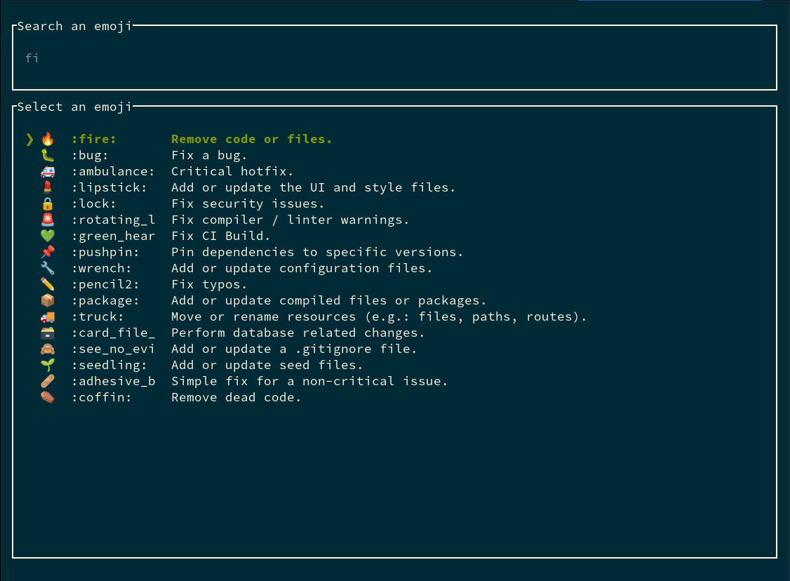

# gimoji

[](https://github.com/zeenix/gimoji/actions/workflows/rust.yml)



A CLI tool that makes it easy to add emojis to your git commit messages. It's very similar to (and
is based on) [gitmoji-cli] but written in Rust.

## Installation

### Fedora Core (>= 38)

```bash
sudo dnf install gimoji
```

### Other OSes

```bash
cargo install -f gimoji
```

## Usage

`gimoji` is primarily intended to be used as a git commit hook. Once installed, ask `gimoji` to
install the hook in your repository:

```bash
cd /path/to/your/project/
gimoji --init
```

Now, whenever you run `git commit`, `gimoji` will kick in and prompt you to choose an emoji.

If you launch `gimoji` directly without any arguments, it will prompt you to choose an emoji and
then copy your choice to the system clipboard.

Use `--help` to see all the available options.

## Rationale

[gitmoji-cli] while being a great tool, can be considerably [slow]. Hence this project. `gimoji` has a
few differences:

* it will launch a full-screen terminal UI to choose an emoji, hence emojis on the console.
* it will only add an emoji to the commit if it's a completely new commit without any existing
  message (e.g it won't kick in when a message is already specified through `-m` option of
  `git commit`, or when amending a commit).
* it does not add anything other than an emoji (like scope, summary etc.) to the commit message and
  lets you do that in your preferred editor.
* Unlike [gitmoji-cli] that downloads and caches its emoji database at runtime, `gimoji` uses a
  pre-compiled database that is included in the binary itself, hence it's much faster to start up
  and does not need Internet access.

The philosophy here is to enable you to quickly and easily choose an emoji and get out of your way.

## License

[MIT](LICENSE)

[gitmoji]: https://github.com/carloscuesta/gitmoji
[gitmoji-cli]: https://github.com/carloscuesta/gitmoji-cli
[slow]: https://github.com/carloscuesta/gitmoji-cli/issues/1096
